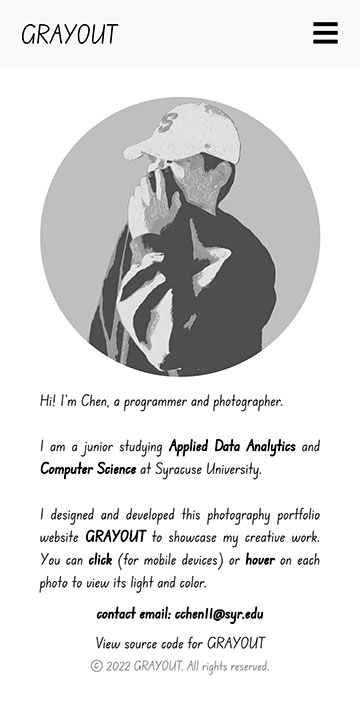

# GRAYOUT

## Description

I created this personal photography portfolio website during the Summer of 2022 to showcase my favorite portraits I have done for potential clients in the future. I like the minimalist design with monochromatic colors on my website. 

## Live Demo

https://grayout.netlify.app/




## Installation

You'll need [Git](https://git-scm.com) and [Node.js](https://nodejs.org/en/download/) (which comes with [npm](http://npmjs.com)) installed on your computer. From your command line:

```bash
# Clone this repository
$ git clone https://github.com/cchenze/photography_portfolio.git

# Go into the repository
$ cd photography_portfolio

# Install dependencies
$ npm install

# Run the app
$ npm start
```

